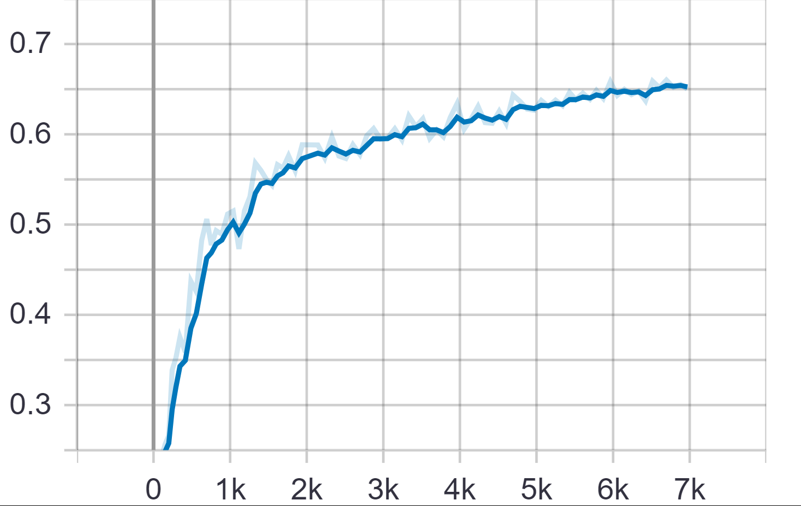
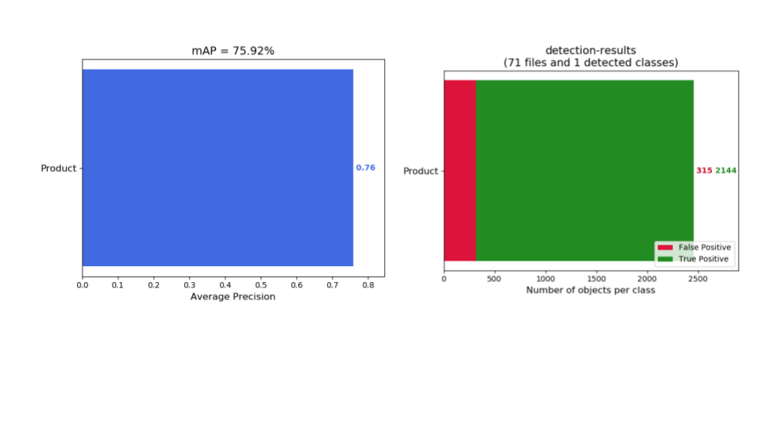

# Shelf_analytics_Retail
Technical round submission to Infilect
## Problem Statement:
  1.	To find the total number of products present on every shelf in a retail store
  2.	Each Shelf image has more than one product and so it is needed to output the total number of products in each shelf image.
***
## Approach:

The tensorflow Objection detetction API is used to train the data with it’s annotation on a pre-trained SSD_Mobilenet_V2 model (previously trained on COCO dataset) with one anchor box per cell of the feature map. 

### Requirements:
install all given in requirements
1. Tensorflow object detection API – (git clone https://github.com/tensorflow/models.git) 
  Download /clone in the site-packages/tensorflow (to embed the api with existing tensorflow lib)
2. SSD model – (http://download.tensorflow.org/models/object_detection/ssd_mobilenet_v2_coco_2018_03_29.tar.gz)
  Download and save as per the structure given
3. The given data – Refer "Structure of files"
4.	Annotation of it’s bounding boxes – download only annotation.txt from the dataset link given
5. All the requirements are tested and verified in OS-Ubuntu (I recommend the same)

#### Issues to solve on installing requirements:
* Protoc not available:
  ```
  sudo apt-get install proto
  sudo apt install protobuf-compiler
  ```
For other os follow the instructions in the link http://google.github.io/proto-lens/installing-protoc.html
* pycoco tools for python:

  - step 1- Run command -> pip install --upgrade cython
  - step 2-  Use this link to clone the recent coco module: https://github.com/philferriere/cocoapi
           (git clone https://github.com/philferriere/cocoapi )
  - step3- cd cocoapi/PythonAPI/
  - step 4- make
  - step 5- pip install pycocotools

***
## Structure of files:
```
Site-packages/tensorflow/models
├── images
| ├── train
| ├── test
| ├── ... 
├── train_labels.csv
├── test_labels.csv
|
├── checkpoints
| ├── model.ckpt.data-00000-of-00001
| ├── model.ckpt.index
| └── model.ckpt.meta
|
├── tf_record
| ├── train.record
| └── val.record
|
├── research
| ├── object_detection
| | ├── training
| | | ├── ssd_mobilenet_v2_coco.config
| | | └── label_map.pbtxt
| | ├── train.py
| | ├── inference_graph

...
```
***
## Environmental setup:

```
$ cd <path_to_your_tensorflow_installation>/models/research/
$ protoc object_detection/protos/*.proto --python_out=.
$ export PYTHONPATH=$PYTHONPATH:`pwd`:`pwd`/slim

```
***
## Data preparation:
To change the data inorder to use the tensorflow model, the following steps are implemented
1.	Convert the data to csv

Run all the cells in Dataset_prep.ipynb
2.	Create tfrecords from the csv files

Run the file generate_tfrecord.py as below
```
python generate_tfrecord.py --csv_input=images\train_labels.csv --image_dir=images\train --output_path=tf_record\train.record
python generate_tfrecord.py --csv_input=images\test_labels.csv --image_dir=images\test --output_path=tf_record\val.record
```
(Make sure the python file is in the path -> site-packages/tensorflow/models/research/object_detection)
***
## Model configurations:
1.	After changing the parameters in the ssd_mobilenet_v2_coco.config (save it in training folder)
2.	Save the label_map.pbtxt in training folder 
***
## Training:
The training is performed by running the train.py file as follows (dont forget to maintain the structure)
```
python train.py --logtostderr --model_dir=training/ --pipeline_config_path=training/ ssd_mobilenet_v2_coco.config
```
The evaluation has been kept as the test data to monitor the mAP and loss and the following plots are obtained
### mAP:

### Recall and loss:


The iterations ran was 7000 and then the model is saved in training 

To avail the frozen model,run the beow file which will be in object_detection folder
```
python export_inference_graph.py --input_type image_tensor --pipeline_config_path training/ ssd_mobilenet_v2_coco.config --trained_checkpoint_prefix training/model.ckpt-6969 --output_directory inference_graph
```

### Hyper parameter tuning performed:
1. Anchor box size -> the average height and width of bounding boxes from the dataset is 301 and 200 respectively and so the anchor box size is fixed as (256,256)
2. Number of anchor boxes per spatial location -> As mentioned, only one anchor box per spatial location is used 
  For which, as number of feature maps and the number of anchor boxes should match, the number of layers for feature extraction is selected as one.
3. The scale and aspect ratio of anchor box -> scale=0.75 and aspect ratio=1.0 
  selection of scale - It is set as the percentage difference between minimum width/height and maximum width/height of bounding boxes in the dataset varies between 59.5% and 68.9%.
  aspect ratio - As most of the bounding boxes are nearly square
4. Other hyper parameters -> batch_size=24 , steps=3000, initial_learning_rate=0.004, exponential_decay_factor=0.95.

***

## Testing:
To run only testing,
- Step 1- Install tensorflow 1.14.0 version
- Step-2- Clone the tensorflow models repo -(git clone https://github.com/tensorflow/models.git)
- Step-3- Save the "detect_objct_frozen_model.ipynb", "inference_graph" and "training" folders to the object_detection folder (<path_to_your_tensorflow_installation>/models/research/object_detection).
- Step-4- Run all the  cells in detect_objct_frozen_model.ipynb which saves a image2product.json file and then saves the groundtruth folder having the groundtruth annotations as needed and then detection-results having the predicted results

### To obtain mAP informtion
Now, clone/download the below github to know the mAP results of test data
https://github.com/Cartucho/mAP

And then save the two folders(groundtruth, detection-results) in the input directory of the cloned github master and replace the given main.py with the existing main.py

Run the below command
```
python main.py
```
saves the mAP and other metrics as mentioned in “metrics.json” and other information in the “output.txt” in output directory.

### Obtained results:


### Sample Images predicted
The left of the both images are groudtruth and the right of the both images are the predicted


You can find all the test prediction results in the test_results_images folder.
***
## Questions to answer???
### What is the purpose of using multiple anchors per feature map cell?
If a particular application of object detection demands the detection of objects of drastically varying sizes, multiple anchor boxes per sptial location is required.

For example: Consider the application of person detection via surveillance cameras, the person near to the camera results in bigger bounding box and the far away person in smaller boundig box with different aspect ratios. This is because, the number of anchor boxes per spatial location is decided based on scale variations and aspect ratio variations of bounding boxes based on the dataset/application.

### Does this problem require multiple anchors? Please justify your answer. 
As analysed with the given data, the shelf analytics is needed to predict products in the shelf with static cameras. As the variation of the size of the products stacked in the shelves is not drastically large, multiple anchors per spatial location is not a necessity. The variation in the width and height of the products in the given dataset is explained in the section "Hyper parameter tuning performed" (above). If the size of the bounding boxes to be predicted varies more than 100 or 200 percentage between them, the multiple anchor boxes might produce better accuracy.

This is futher proved by an experiment performed on multiple anchor boxes of the same network as (scale=[0.2,0.95] and aspect_ratio=[1.0,2.0,0.5,0.75,3.0] ) hasachieved nearly same mAP after training the network for around 7000 steps (almost double the previous experiment). It is both computionally costly and time consuming.

mAP during training:


Furthermore, the test result is comparitively poor with True positives (one anchor box TP-2198 ,multiple anchor boxes TP-2144)

