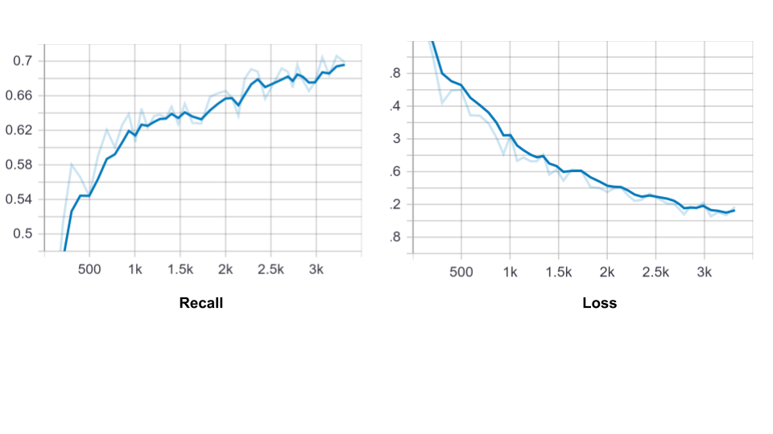

# Shelf_analytics_Retail
Technical round submission to Infilect
## Problem Statement:
  1.	To find the total number of products present on every shelf in a retail store
  2.	Each Shelf image has more than one product and so it is needed to output the total number of products in each shelf image.
***
## Approach:

The tensorflow Objection detetction API is used to train the data with it’s annotation on a pre-trained SSD_Mobilenet_V2 model (previously trained on COCO dataset) with one anchor box per cell of the feature map. 

### Requirements:
install all given in requirements
1. Tensorflow object detection API – (git clone https://github.com/tensorflow/models.git) 
  Download /clone in the site-packages/tensorflow (to embed the api with existing tensorflow lib)
2. SSD model – (http://download.tensorflow.org/models/object_detection/ssd_mobilenet_v2_coco_2018_03_29.tar.gz)
  Download and save as per the structure given
3. The given data – store as per the structure
4.	Annotation of it’s bounding boxes – download only annotation.txt from the dataset link given

#### Issues:
* Protoc not available:
  ```
  sudo apt-get install proto
  sudo apt install protobuf-compiler
  ```

* pycoco tools for python:

  - step 1- Run command -> pip install --upgrade cython
  - step 2-  Use this link to clone the recent coco module: https://github.com/philferriere/cocoapi
           (git clone https://github.com/philferriere/cocoapi )
  - step3- cd cocoapi/PythonAPI/
  - step 4- make
  - step 5- pip install pycocotools

***
## Structure of the files:
```
Site-packages/tensorflow/models
├── images
| ├── train
| ├── test
| ├── ... 
├── train_labels.csv
├── test_labels.csv
|
├── checkpoints
| ├── model.ckpt.data-00000-of-00001
| ├── model.ckpt.index
| └── model.ckpt.meta
|
├── tf_record
| ├── train.record
| └── val.record
|
├── research
| ├── object_detection
| | ├── training
| | | ├── ssd_mobilenet_v2_coco.config
| | | └── label_map.pbtxt
| | ├── train.py
| | ├── inference_graph

...
```
***
## Environmental setup:

```
$ cd <path_to_your_tensorflow_installation>/models/research/
$ protoc object_detection/protos/*.proto --python_out=.
$ export PYTHONPATH=$PYTHONPATH:`pwd`:`pwd`/slim

```
***
## Data preparation:
To change the data inorder to use the tensorflow model, the following steps are implemented
1.	Convert the data to csv

Run all the cells in Dataset_prep.ipynb
2.	Create tfrecords from the csv files

Run the file generate_tfrecord.py as below
```
python generate_tfrecord.py --csv_input=images\train_labels.csv --image_dir=images\train --output_path=tf_record\train.record
python generate_tfrecord.py --csv_input=images\test_labels.csv --image_dir=images\test --output_path=tf_record\val.record
```
(Make sure the python file is in the path -> site-packages/tensorflow/models/research/object_detection)
***
## Model configurations:
1.	After changing the parameters in the ssd_mobilenet_v2_coco.config (save it in training folder)
2.	Save the label_map.pbtxt in training folder 
***
## Training:
The training is performed by running the train.py file as follows (dont forget to maintain the structure)
```
python train.py --logtostderr --model_dir=training/ --pipeline_config_path=training/ ssd_mobilenet_v2_coco.config
```
The evaluation has been kept as the test data to monitor the mAP and loss and the following plots are obtained
### mAP:

### Recall and loss:


The iterations ran was 7000 and then the model is saved in training 

To avail the frozen model,rn the beow file which will be in object_detection folder
```
python export_inference_graph.py --input_type image_tensor --pipeline_config_path training/ ssd_mobilenet_v2_coco.config --trained_checkpoint_prefix training/model.ckpt-6969 --output_directory inference_graph
```
***
## Testing:
To run only testing,

Run all the  cells in detect_objct_frozen_model.ipynb which saves a image2product.json file and then saves the groundtruth folder having the groundtruth annotations as needed and then detection-results having the predicted results

Now, clone/download the below github to know the mAP results of test data
https://github.com/Cartucho/mAP

And then save the two folders(groundtruth, detection-results) in the input directory of the cloned github master and replace the given main.py with the existing main.py

Run the below command
```
python main.py
```
saves the mAP and other metrics as mentioned in “metrics.json” and other information in the “output.txt” in output directory.

### Obtained results:


### Images predicted
The left of the both images are groudtruth and the right of the both images are the predicted

***


